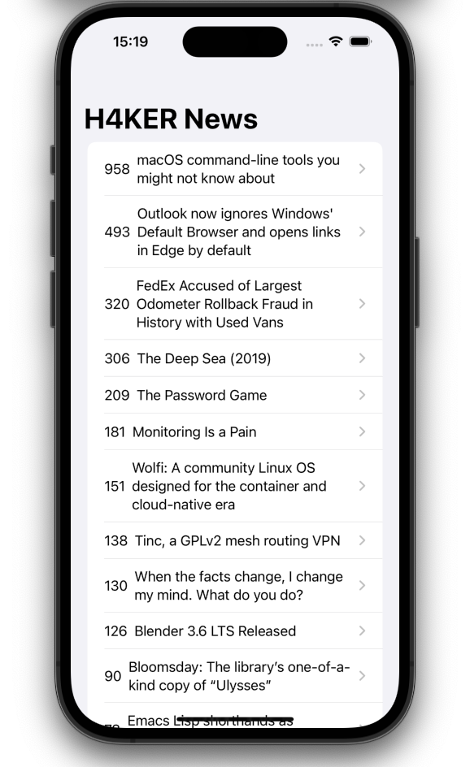

A H4KER News app feed made in SwiftUI for the devs.

## Our Goal

The objective of this challenge is to apply the skills and get an app with functionality of to pull data by a website API.

> This is a project made from The App Brewery's Complete App Developement Bootcamp, check out at [www.appbrewery.co](https://www.appbrewery.co/)
